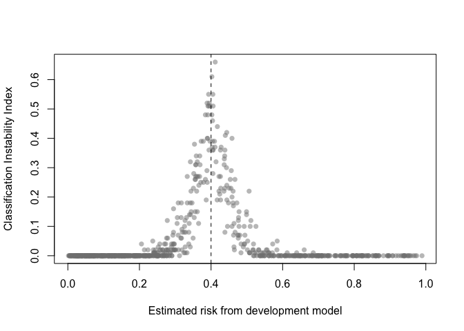
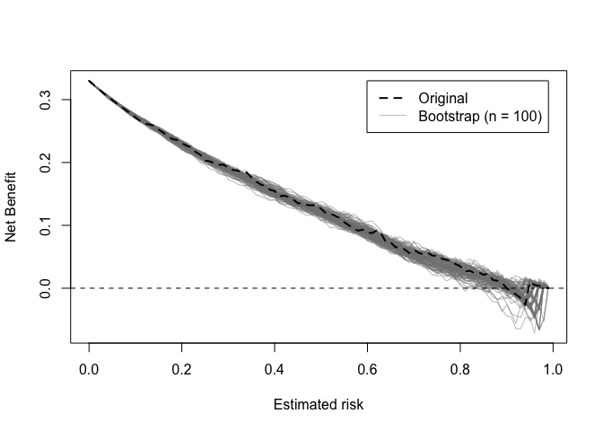

<!-- README.md is generated from README.Rmd. Please edit that file -->

# pminternal: Internal Validation of Clinical Prediction Models

<!-- badges: start -->
<!-- badges: end -->

The goal is to offer a package that can produce bias-corrected
performance measures for clinical prediction models with binary outcomes
for a range of model development approaches available in R (similar to
`rms::validate`). There are also functions for assessing prediction
stability, as described in [Riley and Collins
(2023)](https://doi.org/10.1002/bimj.202200302).

To install:

``` r
install.packages("pminternal") # cran
# or 
devtools::install_github("stephenrho/pminternal") # development
```

## Example

In the example below we use bootstrapping to correct performance
measures for a `glm` via calculation of ‘optimism’ (see
`vignette("pminternal")`, `vignette("validate-examples")`, and
`vignette("missing-data")` for more examples):

``` r
library(pminternal)

# make some data
set.seed(2345)
n <- 800
p <- 10

X <- matrix(rnorm(n*p), nrow = n, ncol = p)
LP <- -1 + apply(X[, 1:5], 1, sum) # first 5 variables predict outcome
y <- rbinom(n, 1, plogis(LP))

dat <- data.frame(y, X)

# fit a model
mod <- glm(y ~ ., data = dat, family = "binomial")

# calculate bootstrap optimism corrected performance measures
(val <- validate(fit = mod, method = "boot_optimism", B = 100))
#> It is recommended that B >= 200 for bootstrap validation
#>           apparent optimism corrected   n
#> C           0.8567   0.0093    0.8474 100
#> Brier       0.1423  -0.0054    0.1477 100
#> Intercept   0.0000   0.0175   -0.0175 100
#> Slope       1.0000   0.0529    0.9471 100
#> Eavg        0.0045  -0.0048    0.0093 100
#> E50         0.0039  -0.0050    0.0089 100
#> E90         0.0081  -0.0107    0.0187 100
#> Emax        0.0109  -0.0057    0.0165 100
#> ECI         0.0027  -0.0038    0.0065 100
```

The other available methods for calculating bias corrected performance
are the simple bootstrap (`boot_simple`), 0.632 bootstrap optimism
(`.632`), optimism via cross-validation (`cv_optimism`), and regular
cross-validation (`cv_average`). Please see `?pminternal::validate` and
the references therein. Bias corrected calibration curves can also be
produced (see `pminternal::cal_plot`). Confidence intervals can also be
added via `confint`.

For models that cannot be supported via `fit`, users are able to specify
their own model (`model_fun`) and prediction (`pred_fun`) functions as
shown below. Note that when specifying user-defined model and prediction
functions the data and outcome must also be provided. It is crucial that
`model_fun` implements the entire model development procedure (variable
selection, hyperparameter tuning, etc). For more examples, see
`vignette("pminternal")` and `vignette("validate-examples")`.

``` r
# fit a glm with lasso penalty
library(glmnet)
#> Loading required package: Matrix
#> Loaded glmnet 4.1-8

lasso_fun <- function(data, ...){
  y <- data$y
  x <- as.matrix(data[, which(colnames(data) != "y")])
  
  cv <- cv.glmnet(x=x, y=y, alpha=1, nfolds = 10, family="binomial")
  lambda <- cv$lambda.min
  
  glmnet(x=x, y=y, alpha = 1, lambda = lambda, family="binomial")
}

lasso_predict <- function(model, data, ...){
  y <- data$y
  x <- as.matrix(data[, which(colnames(data) != "y")])
  
  predict(model, newx = x, type = "response")[,1]
}

(val <- validate(data = dat, outcome = "y", 
                 model_fun = lasso_fun, pred_fun = lasso_predict, 
                 method = "boot_optimism", B = 100))
#> It is recommended that B >= 200 for bootstrap validation
#>           apparent optimism corrected   n
#> C            0.856   0.0070     0.849 100
#> Brier        0.143  -0.0041     0.147 100
#> Intercept    0.080   0.0191     0.061 100
#> Slope        1.155   0.0449     1.110 100
#> Eavg         0.020   0.0013     0.019 100
#> E50          0.019   0.0026     0.017 100
#> E90          0.040   0.0021     0.038 100
#> Emax         0.044   0.0145     0.029 100
#> ECI          0.053   0.0087     0.044 100
```

The output of `validate` (with `method = "boot_*"`) can be used to
produce plots for assessing the stability of model predictions (across
models developed on bootstrap resamples).

A prediction (in)stability plot shows predictions from the `B` (in this
case 100) bootstrap models applied to the development data.

``` r
prediction_stability(val, smooth_bounds = TRUE)
```


A MAPE plot shows the mean absolute prediction error, which is the
difference between the predicted risk from the development model and
each of the `B` bootstrap models.

``` r
mape_stability(val)
```


A calibration (in)stability plot depict the original calibration curve
along with `B` calibration curves from the bootstrap models applied to
the original data (`y`).

``` r
calibration_stability(val)
```


The classification instability index (CII) is the proportion of
individuals that change predicted class (present/absent, 1/0) when
predicted risk is compared to some threshold. For example, a patient
predicted to be in class 1 would receive a CII of 0.3 if 30% of the
bootstrap models led to a predicted class of 0.

``` r
classification_stability(val, threshold = .4)
```



Decision curves implied by the original and bootstrap models can also be
plotted.

``` r
dcurve_stability(val)
```


